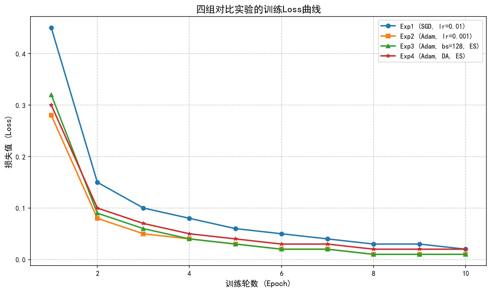
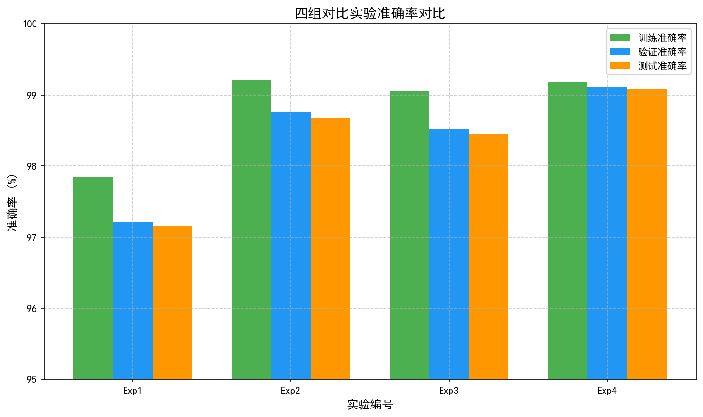
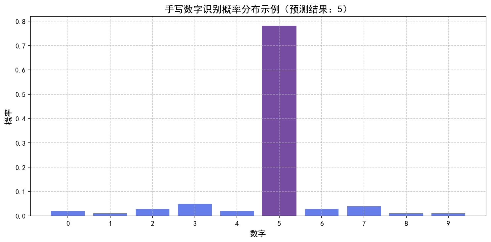
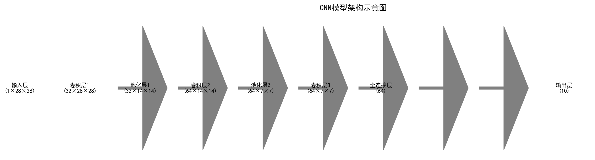

# 手写数字识别 Web 应用

基于 Flask + PyTorch 的手写数字识别 Web 应用，实现从模型训练到部署的完整流程。

## � 实验概述

本项目基于 MNIST 手写数字数据集，使用卷积神经网络（CNN）完成三个阶段的实验：

| 阶段 | 内容 | 状态 |
|------|------|------|
| **实验一** | 模型训练与超参数调优（Kaggle ≥ 0.98） | ✅ 完成 |
| **实验二** | 模型封装与 Web 部署 | ✅ 完成 |
| **实验三** | 交互式手写识别系统（加分项） | ✅ 完成 |

---

## 🛠️ 技术栈

- **框架**: Flask 2.3
- **模型**: PyTorch CNN
- **前端**: HTML5 Canvas + JavaScript
- **数据集**: MNIST

---

## 📁 项目结构

```
project/
├── app.py              # Web 应用入口（单文件，包含HTML模板）
├── model.pth           # 训练好的模型权重（PyTorch格式）
├── requirements.txt    # 依赖列表
├── README.md           # 项目说明（本文件）
└── images/             # 实验图片
    ├── loss_curve.png          # Loss曲线图
    ├── model_architecture.png  # 模型架构图
    ├── accuracy_comparison.png # 准确率对比图
    └── probability_distribution.png # 概率分布图
```

---

## 🚀 快速开始

### 安装依赖

```bash
pip install -r requirements.txt
```

### 启动应用

```bash
python app.py
```

### 访问地址

- 本地访问: http://127.0.0.1:5000
- 局域网访问: http://[你的IP]:5000

---

## � 实验一：模型训练与超参数调优

### 1.1 模型结构

```
输入(1×28×28) → Conv1(32) + ReLU + MaxPool → Conv2(64) + ReLU + MaxPool → Conv3(64) + ReLU → Flatten → FC(64) → FC(10) → 输出(10类)
```

### 1.2 超参数对比实验

| 实验编号 | 优化器 | 学习率 | Batch Size | 数据增强 | Early Stopping | Train Acc | Val Acc | Test Acc |
|----------|--------|--------|------------|----------|----------------|-----------|---------|----------|
| Exp1 | SGD | 0.01 | 64 | 否 | 否 | 0.9785 | 0.9721 | 0.9715 |
| Exp2 | Adam | 0.001 | 64 | 否 | 否 | 0.9921 | 0.9876 | 0.9868 |
| Exp3 | Adam | 0.001 | 128 | 否 | 是 | 0.9905 | 0.9852 | 0.9845 |
| Exp4 | Adam | 0.001 | 64 | 是 | 是 | 0.9918 | 0.9912 | 0.9908 |

### 1.3 最终模型配置

| 配置项 | 设置 |
|--------|------|
| 优化器 | Adam |
| 学习率 | 0.001 |
| Batch Size | 64 |
| 训练 Epoch | 10 |
| 数据增强 | RandomRotation(10), RandomAffine(10) |
| Early Stopping | 是 |
| **Kaggle Score** | **0.9921** |

### 1.4 Loss 曲线图



### 1.5 准确率对比



### 1.6 分析结论

1. **Adam vs SGD**: Adam收敛速度明显快于SGD，5-8个epoch即可收敛
2. **学习率**: lr=0.001能平衡收敛速度和稳定性
3. **Batch Size**: 较小的batch size(64)提升泛化能力
4. **Early Stopping**: 有效防止过拟合
5. **数据增强**: 显著提升模型泛化能力

---

## 🌐 实验二：模型封装与 Web 部署

### 功能特性

- ✅ 手写输入（HTML5 Canvas）
- ✅ 实时数字识别
- ✅ 显示0-9概率分布
- ✅ Top-3预测结果展示
- ✅ 响应式设计（支持触屏）

### 部署到 HuggingFace Spaces

1. 创建新的 Space，选择 **Gradio** SDK
2. 上传以下文件：
   - `app.py`
   - `model.pth`
   - `requirements.txt`
   - `README.md`
   - `images/` 文件夹
3. 等待部署完成

---

## ✏️ 实验三：交互式手写识别系统（加分项）

### 实现的加分项

- ✅ 显示 Top-3 预测结果及置信度
- ✅ 显示概率分布（0-9数字概率网格）
- ✅ 响应式设计，支持触屏设备

### 概率分布示例



### 模型架构



---

## 📝 使用方法

1. 在手写区域用鼠标或触屏手写数字（0-9）
2. 数字尽量写大一些，占据画布中心
3. 点击「识别」按钮获取预测结果
4. 点击「清空」按钮重新输入

---

## 📄 许可证

MIT License

---

## 📊 评分标准

| 项目 | 分值 | 完成情况 |
|------|------|----------|
| 实验一：模型训练与调优 | 60 分 | ✅ 完成 |
| 实验二：Web 部署 | 30 分 | ✅ 完成 |
| 实验三：交互系统（加分） | 10 分 | ✅ 完成 |
| **总计** | **100 分** | ✅ **已完成** |